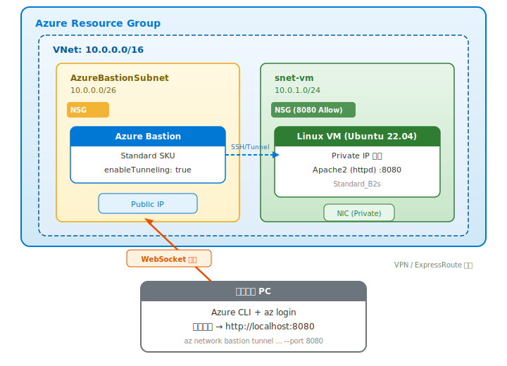

# Azure Bastion トンネリング ハンズオン

VPN や ExpressRoute を使わずに、**Azure Bastion Standard のトンネリング機能**を利用して、ローカル PC のブラウザからプライベート IP の Linux VM 上の Web サーバーにアクセスする方法を体験するハンズオンです。

## アーキテクチャ



## 前提条件

- Azure サブスクリプション
- ローカル PC に以下がインストール済みであること
  - [Azure CLI](https://learn.microsoft.com/ja-jp/cli/azure/install-azure-cli)
  - [Azure Developer CLI (azd)](https://learn.microsoft.com/ja-jp/azure/developer/azure-developer-cli/install-azd)
- `az login` で Azure にログイン済みであること

## デプロイされるリソース

| リソース | 説明 |
|---|---|
| Virtual Network | `10.0.0.0/16`、2つのサブネットを含む |
| NSG (VM サブネット用) | VNet 内からの 8080 ポートを許可 |
| NSG (Bastion サブネット用) | Bastion に必要なルールを設定 |
| Linux VM (Ubuntu 22.04) | Private IP のみ、Apache2 を 8080 番ポートで起動 |
| Azure Bastion (Standard) | トンネリング機能を有効化 |
| Public IP | Bastion 用 |

## ハンズオン手順

### Step 1: リポジトリのクローン

```bash
git clone https://github.com/h-morozumi/Azure-RemoteVM-tunneling-Handson.git
cd Azure-RemoteVM-tunneling-Handson
```

### Step 2: VM のパスワードを設定

```bash
azd env set AZURE_VM_ADMIN_PASSWORD '<パスワード>'
```

> **パスワード要件**: 12文字以上、大文字・小文字・数字・記号のうち3種類以上を含むこと

### Step 3: Azure にデプロイ

```bash
azd up
```

実行すると以下を聞かれます:
1. **Environment name** — 任意の名前（例: `test-tunneling-01`）
2. **Azure Subscription** — 使用するサブスクリプション
3. **Azure location** — リージョン（例: `Japan East`）

デプロイには約 10〜15 分かかります（Bastion の作成に時間がかかります）。

完了すると、以下のような出力が表示されます:

```
Outputs:
  BASTION_NAME          = bas-xxxxxxxxx
  BASTION_TUNNEL_COMMAND = az network bastion tunnel --name bas-xxxxxxxxx --resource-group rg-xxxxx --target-resource-id /subscriptions/.../vm-xxxxxxxxx --resource-port 8080 --port 8080
  RESOURCE_GROUP        = rg-xxxxx
  VM_NAME               = vm-xxxxxxxxx
  VM_PRIVATE_IP         = 10.0.1.x
  VM_RESOURCE_ID        = /subscriptions/.../vm-xxxxxxxxx
  VNET_NAME             = vnet-xxxxxxxxx
```

### Step 4: Bastion トンネルを開始

ローカル PC のターミナルで、出力された `BASTION_TUNNEL_COMMAND` をそのまま実行します。

**bash / zsh の場合:**

```bash
az network bastion tunnel \
  --name <BASTION_NAME> \
  --resource-group <RESOURCE_GROUP> \
  --target-resource-id <VM_RESOURCE_ID> \
  --resource-port 8080 \
  --port 8080
```

**PowerShell の場合:**

```powershell
az network bastion tunnel `
  --name <BASTION_NAME> `
  --resource-group <RESOURCE_GROUP> `
  --target-resource-id <VM_RESOURCE_ID> `
  --resource-port 8080 `
  --port 8080
```

> **ヒント**: デプロイ出力の `BASTION_TUNNEL_COMMAND` は1行で出力されるので、そのままコピペすれば bash / PowerShell どちらでも動きます。

成功すると以下のように表示されます:

```
Opening tunnel on port: 8080
Tunnel is ready, connect on port 8080
Ctrl + C to close
```

### Step 5: ブラウザでアクセス

トンネルを開いたまま、ローカル PC のブラウザで以下にアクセスします:

```
http://localhost:8080
```

Apache2 のデフォルトページが表示されれば成功です！

### Step 6: リソースの削除

ハンズオン終了後はリソースを削除してください:

```bash
azd down
```

## 仕組みの解説

1. Azure Bastion Standard は `enableTunneling: true` を設定すると、`az network bastion tunnel` コマンドでローカルポートを VM のポートに転送できます
2. ローカル PC の Azure CLI が Bastion との間に **WebSocket 接続**を確立します
3. ローカルの `localhost:8080` へのリクエストが、Bastion 経由で VM の `8080` に転送されます
4. VPN や ExpressRoute は不要で、**Azure CLI の認証情報**だけでプライベートネットワークにアクセスできます

## 補足

### SSH 接続も可能

同じ仕組みで SSH も可能です（別のターミナルで実行）:

**bash / zsh の場合:**

```bash
# トンネルを開く
az network bastion tunnel \
  --name <BASTION_NAME> \
  --resource-group <RESOURCE_GROUP> \
  --target-resource-id <VM_RESOURCE_ID> \
  --resource-port 22 \
  --port 2222
```

**PowerShell の場合:**

```powershell
# トンネルを開く
az network bastion tunnel `
  --name <BASTION_NAME> `
  --resource-group <RESOURCE_GROUP> `
  --target-resource-id <VM_RESOURCE_ID> `
  --resource-port 22 `
  --port 2222
```

**別のターミナルから SSH:**

```bash
ssh azureuser@localhost -p 2222
```

### 複数ポートの転送

`az network bastion tunnel` は1コマンドにつき1ポートのみ転送できます。複数ポートが必要な場合は、複数のターミナルで並列実行してください。

## ファイル構成

```
├── azure.yaml                  # azd 設定ファイル
├── infra/
│   ├── main.bicep              # メインテンプレート
│   ├── main.bicepparam         # パラメータファイル
│   ├── abbreviations.json      # リソース名略称定義
│   └── modules/
│       ├── vnet.bicep           # VNet + サブネット + NSG
│       ├── vm-linux.bicep       # Linux VM (httpd 8080)
│       └── bastion.bicep        # Azure Bastion Standard
└── README.md
```

## 参考リンク

- [Azure Bastion トンネル機能を使ってローカルポートを転送する](https://learn.microsoft.com/ja-jp/azure/bastion/connect-ip-address)
- [Azure Bastion のトンネリングについて (az network bastion tunnel)](https://learn.microsoft.com/ja-jp/cli/azure/network/bastion?view=azure-cli-latest#az-network-bastion-tunnel)
- [Azure Bastion の SKU と機能](https://learn.microsoft.com/ja-jp/azure/bastion/configuration-settings#skus)
- [Azure Developer CLI (azd) の概要](https://learn.microsoft.com/ja-jp/azure/developer/azure-developer-cli/overview)