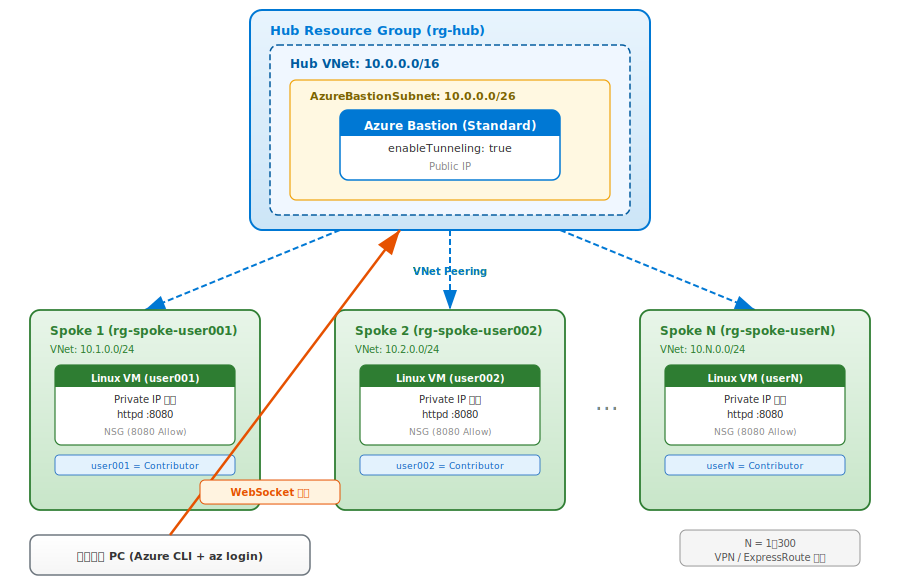

# 複数ユーザ一括構築ガイド（管理者向け）

300人規模のハンズオン環境を Hub & Spoke 構成で一括構築するためのガイドです。

> **⚠️ 免責事項**: 本ガイドに記載のスクリプト、Bicep テンプレート、および手順は**未検証**の参考情報です。実環境での利用にあたっては、必ずご自身で十分なテストを行ったうえでご利用ください。本ガイドの内容に起因するいかなる問題・損害についても、作成者は責任を負いません。

## アーキテクチャ概要



## 設計方針

| 項目 | 方針 |
|---|---|
| Hub | 1つの Bicep で1回デプロイ（Bastion Standard + VNet） |
| Spoke | 1ユーザ = 1リソースグループ、CSV + スクリプトでループ実行 |
| IP 割り当て | `10.N.0.0/24`（N = ユーザ番号 1〜300） |
| Peering | 双方向、Spoke 側は Bicep、Hub 側は CLI で追加 |
| 並列化 | `--no-wait` で同時デプロイ |
| リトライ | 失敗ユーザだけ CSV からフィルタして再実行 |
| 権限 | ユーザのリソースグループに Contributor ロールを割り当て |
| Policy | 管理グループまたはリソースグループに設定 |

## IP アドレス設計

```
Hub VNet:             10.0.0.0/16
  AzureBastionSubnet:   10.0.0.0/26

Spoke VNet (user001):  10.1.0.0/24   → VM Subnet: 10.1.0.0/25
Spoke VNet (user002):  10.2.0.0/24   → VM Subnet: 10.2.0.0/25
Spoke VNet (user003):  10.3.0.0/24   → VM Subnet: 10.3.0.0/25
...
Spoke VNet (user255):  10.255.0.0/24 → VM Subnet: 10.255.0.0/25
Spoke VNet (user256):  11.1.0.0/24   → VM Subnet: 11.1.0.0/25
...
Spoke VNet (user300):  11.45.0.0/24  → VM Subnet: 11.45.0.0/25
```

> 300ユーザの場合、`10.N.0.0/24`（N=1〜255）で255ユーザ、残り45ユーザは `11.N.0.0/24` で割り当てます。すべてプライベートIP範囲（`10.0.0.0/8`、`11.x` は予約外のため実運用では `10.0.0.0/8` 内に収まるよう `10.N.M.0/24` 形式に変更することを推奨）。

### 推奨: 10.0.0.0/8 内に収める設計

```
Spoke VNet (user001):  10.1.0.0/24
Spoke VNet (user002):  10.2.0.0/24
...
Spoke VNet (user255):  10.255.0.0/24
Spoke VNet (user256):  10.0.1.0/24
Spoke VNet (user257):  10.0.2.0/24
...
Spoke VNet (user300):  10.0.45.0/24
```

## ファイル構成

```
bulk-deploy/
├── hub/
│   └── main.bicep              # Hub VNet + Bastion
├── spoke/
│   └── main.bicep              # Spoke 1ユーザ分 (VNet + VM + Peering)
├── users.csv                   # ユーザ一覧
├── deploy.sh                   # 一括デプロイスクリプト
└── cleanup.sh                  # 一括削除スクリプト
```

## users.csv

ユーザ一覧を CSV で管理します。必要に応じて列を追加してください。

```csv
userId,userName,adminPassword
001,user001,P@ssw0rd001!
002,user002,P@ssw0rd002!
003,user003,P@ssw0rd003!
...
300,user300,P@ssw0rd300!
```

> **セキュリティ注意**: パスワードを CSV に平文で書く場合は、ファイルを `.gitignore` に追加し、Git にコミットしないでください。Azure Key Vault を併用する方法も検討してください。

## Hub Bicep テンプレート

### hub/main.bicep

```bicep
param location string = resourceGroup().location
param bastionName string = 'bas-hub'
param vnetName string = 'vnet-hub'

param vnetAddressPrefix string = '10.0.0.0/16'
param bastionSubnetAddressPrefix string = '10.0.0.0/26'

var tags = {
  purpose: 'handson-hub'
}

// NSG for Azure Bastion Subnet
resource bastionNsg 'Microsoft.Network/networkSecurityGroups@2024-01-01' = {
  name: 'nsg-bastion-subnet'
  location: location
  tags: tags
  properties: {
    securityRules: [
      { name: 'AllowHttpsInbound', properties: { priority: 120, direction: 'Inbound', access: 'Allow', protocol: 'Tcp', sourceAddressPrefix: 'Internet', sourcePortRange: '*', destinationAddressPrefix: '*', destinationPortRange: '443' } }
      { name: 'AllowGatewayManagerInbound', properties: { priority: 130, direction: 'Inbound', access: 'Allow', protocol: 'Tcp', sourceAddressPrefix: 'GatewayManager', sourcePortRange: '*', destinationAddressPrefix: '*', destinationPortRange: '443' } }
      { name: 'AllowAzureLoadBalancerInbound', properties: { priority: 140, direction: 'Inbound', access: 'Allow', protocol: 'Tcp', sourceAddressPrefix: 'AzureLoadBalancer', sourcePortRange: '*', destinationAddressPrefix: '*', destinationPortRange: '443' } }
      { name: 'AllowBastionHostCommunicationInbound', properties: { priority: 150, direction: 'Inbound', access: 'Allow', protocol: '*', sourceAddressPrefix: 'VirtualNetwork', sourcePortRange: '*', destinationAddressPrefix: 'VirtualNetwork', destinationPortRanges: [ '8080', '5701' ] } }
      { name: 'AllowSshRdpOutbound', properties: { priority: 100, direction: 'Outbound', access: 'Allow', protocol: 'Tcp', sourceAddressPrefix: '*', sourcePortRange: '*', destinationAddressPrefix: 'VirtualNetwork', destinationPortRanges: [ '22', '3389' ] } }
      { name: 'AllowAzureCloudOutbound', properties: { priority: 110, direction: 'Outbound', access: 'Allow', protocol: 'Tcp', sourceAddressPrefix: '*', sourcePortRange: '*', destinationAddressPrefix: 'AzureCloud', destinationPortRange: '443' } }
      { name: 'AllowBastionHostCommunicationOutbound', properties: { priority: 120, direction: 'Outbound', access: 'Allow', protocol: '*', sourceAddressPrefix: 'VirtualNetwork', sourcePortRange: '*', destinationAddressPrefix: 'VirtualNetwork', destinationPortRanges: [ '8080', '5701' ] } }
      { name: 'AllowGetSessionInformationOutbound', properties: { priority: 130, direction: 'Outbound', access: 'Allow', protocol: '*', sourceAddressPrefix: '*', sourcePortRange: '*', destinationAddressPrefix: 'Internet', destinationPortRanges: [ '80', '443' ] } }
    ]
  }
}

// Hub VNet
resource vnet 'Microsoft.Network/virtualNetworks@2024-01-01' = {
  name: vnetName
  location: location
  tags: tags
  properties: {
    addressSpace: {
      addressPrefixes: [ vnetAddressPrefix ]
    }
    subnets: [
      {
        name: 'AzureBastionSubnet'
        properties: {
          addressPrefix: bastionSubnetAddressPrefix
          networkSecurityGroup: { id: bastionNsg.id }
        }
      }
    ]
  }
}

// Public IP for Bastion
resource bastionPip 'Microsoft.Network/publicIPAddresses@2024-01-01' = {
  name: 'pip-${bastionName}'
  location: location
  tags: tags
  sku: { name: 'Standard' }
  properties: { publicIPAllocationMethod: 'Static' }
}

// Bastion Standard
resource bastion 'Microsoft.Network/bastionHosts@2024-01-01' = {
  name: bastionName
  location: location
  tags: tags
  sku: { name: 'Standard' }
  properties: {
    enableTunneling: true
    ipConfigurations: [
      {
        name: 'bastion-ipconfig'
        properties: {
          subnet: { id: vnet.properties.subnets[0].id }
          publicIPAddress: { id: bastionPip.id }
        }
      }
    ]
  }
}

output hubVnetId string = vnet.id
output hubVnetName string = vnet.name
output bastionName string = bastion.name
```

## Spoke Bicep テンプレート

### spoke/main.bicep

```bicep
param location string = resourceGroup().location
param userId string
param userName string

@secure()
param adminPassword string

param vnetCidr string
param subnetCidr string
param hubVnetId string

param vmSize string = 'Standard_B2s'

var tags = {
  purpose: 'handson-spoke'
  user: userName
}

var vnetName = 'vnet-${userName}'
var vmName = 'vm-${userName}'

// NSG for VM Subnet
resource vmNsg 'Microsoft.Network/networkSecurityGroups@2024-01-01' = {
  name: 'nsg-${userName}'
  location: location
  tags: tags
  properties: {
    securityRules: [
      {
        name: 'Allow-HTTP-8080-Inbound'
        properties: {
          priority: 100
          direction: 'Inbound'
          access: 'Allow'
          protocol: 'Tcp'
          sourceAddressPrefix: 'VirtualNetwork'
          sourcePortRange: '*'
          destinationAddressPrefix: '*'
          destinationPortRange: '8080'
        }
      }
    ]
  }
}

// Spoke VNet
resource vnet 'Microsoft.Network/virtualNetworks@2024-01-01' = {
  name: vnetName
  location: location
  tags: tags
  properties: {
    addressSpace: {
      addressPrefixes: [ vnetCidr ]
    }
    subnets: [
      {
        name: 'snet-vm'
        properties: {
          addressPrefix: subnetCidr
          networkSecurityGroup: { id: vmNsg.id }
        }
      }
    ]
  }
}

// Peering: Spoke → Hub
resource spokeToHubPeering 'Microsoft.Network/virtualNetworks/virtualNetworkPeerings@2024-01-01' = {
  parent: vnet
  name: 'peer-to-hub'
  properties: {
    remoteVirtualNetwork: { id: hubVnetId }
    allowForwardedTraffic: true
    allowVirtualNetworkAccess: true
    allowGatewayTransit: false
    useRemoteGateways: false
  }
}

// NIC (Private IP only)
resource nic 'Microsoft.Network/networkInterfaces@2024-01-01' = {
  name: 'nic-${vmName}'
  location: location
  tags: tags
  properties: {
    ipConfigurations: [
      {
        name: 'ipconfig1'
        properties: {
          subnet: { id: vnet.properties.subnets[0].id }
          privateIPAllocationMethod: 'Dynamic'
        }
      }
    ]
  }
}

// Cloud-init: Apache2 on port 8080
var cloudInitScript = '''
#cloud-config
package_update: true
package_upgrade: true
packages:
  - apache2
runcmd:
  - sed -i 's/Listen 80/Listen 8080/' /etc/apache2/ports.conf
  - sed -i 's/:80/:8080/' /etc/apache2/sites-enabled/000-default.conf
  - systemctl restart apache2
  - systemctl enable apache2
'''

// Linux VM
resource vm 'Microsoft.Compute/virtualMachines@2024-03-01' = {
  name: vmName
  location: location
  tags: tags
  properties: {
    hardwareProfile: { vmSize: vmSize }
    osProfile: {
      computerName: take(vmName, 15)
      adminUsername: 'azureuser'
      adminPassword: adminPassword
      customData: base64(cloudInitScript)
      linuxConfiguration: { disablePasswordAuthentication: false }
    }
    storageProfile: {
      imageReference: {
        publisher: 'Canonical'
        offer: '0001-com-ubuntu-server-jammy'
        sku: '22_04-lts-gen2'
        version: 'latest'
      }
      osDisk: {
        createOption: 'FromImage'
        managedDisk: { storageAccountType: 'StandardSSD_LRS' }
      }
    }
    networkProfile: {
      networkInterfaces: [ { id: nic.id } ]
    }
  }
}

output vmName string = vm.name
output vmId string = vm.id
output vnetName string = vnet.name
output vnetId string = vnet.id
output privateIpAddress string = nic.properties.ipConfigurations[0].properties.privateIPAddress
```

## 一括デプロイスクリプト

### deploy.sh

```bash
#!/bin/bash
set -euo pipefail

# ============================================================
# 設定
# ============================================================
SUBSCRIPTION_ID="<your-subscription-id>"
LOCATION="japaneast"
HUB_RG="rg-hub"
HUB_VNET_NAME="vnet-hub"
USERS_CSV="bulk-deploy/users.csv"
DOMAIN="yourdomain.com"  # ユーザの UPN ドメイン

HUB_VNET_ID="/subscriptions/${SUBSCRIPTION_ID}/resourceGroups/${HUB_RG}/providers/Microsoft.Network/virtualNetworks/${HUB_VNET_NAME}"

# ============================================================
# IP アドレス計算関数
# ユーザ番号 (1-300) から VNet CIDR と Subnet CIDR を算出
# ============================================================
calc_ip() {
  local n=$1
  if [ "$n" -le 255 ]; then
    echo "10.${n}.0.0/24,10.${n}.0.0/25"
  else
    local m=$((n - 255))
    echo "10.0.${m}.0/24,10.0.${m}.0/25"
  fi
}

# ============================================================
# 1. Hub デプロイ
# ============================================================
echo "=== [Hub] リソースグループ作成 ==="
az group create --name "$HUB_RG" --location "$LOCATION" --output none

echo "=== [Hub] デプロイ開始 ==="
az deployment group create \
  --resource-group "$HUB_RG" \
  --template-file bulk-deploy/hub/main.bicep \
  --parameters location="$LOCATION" \
  --output none

echo "=== [Hub] デプロイ完了 ==="

# ============================================================
# 2. Spoke 一括デプロイ
# ============================================================
echo "=== [Spoke] 一括デプロイ開始 ==="

DEPLOY_COUNT=0
FAIL_COUNT=0

tail -n +2 "$USERS_CSV" | while IFS=',' read -r userId userName adminPassword; do
  # 前後の空白を除去
  userId=$(echo "$userId" | xargs)
  userName=$(echo "$userName" | xargs)
  adminPassword=$(echo "$adminPassword" | xargs)

  SPOKE_RG="rg-spoke-${userName}"
  IFS=',' read -r VNET_CIDR SUBNET_CIDR <<< "$(calc_ip "$userId")"

  echo "--- [${userName}] VNet=${VNET_CIDR}, Subnet=${SUBNET_CIDR} ---"

  # リソースグループ作成
  az group create --name "$SPOKE_RG" --location "$LOCATION" --output none

  # Contributor ロール割り当て（既に存在する場合はスキップ）
  az role assignment create \
    --assignee "${userName}@${DOMAIN}" \
    --role "Contributor" \
    --scope "/subscriptions/${SUBSCRIPTION_ID}/resourceGroups/${SPOKE_RG}" \
    --output none 2>/dev/null || echo "  [WARN] ロール割り当てスキップ: ${userName}"

  # Spoke デプロイ (--no-wait で並列化)
  az deployment group create \
    --resource-group "$SPOKE_RG" \
    --template-file bulk-deploy/spoke/main.bicep \
    --parameters \
      location="$LOCATION" \
      userId="$userId" \
      userName="$userName" \
      adminPassword="$adminPassword" \
      vnetCidr="$VNET_CIDR" \
      subnetCidr="$SUBNET_CIDR" \
      hubVnetId="$HUB_VNET_ID" \
    --no-wait \
    --output none \
    && DEPLOY_COUNT=$((DEPLOY_COUNT + 1)) \
    || FAIL_COUNT=$((FAIL_COUNT + 1))

  # Hub → Spoke Peering (--no-wait で並列化)
  az network vnet peering create \
    --name "peer-to-${userName}" \
    --resource-group "$HUB_RG" \
    --vnet-name "$HUB_VNET_NAME" \
    --remote-vnet "/subscriptions/${SUBSCRIPTION_ID}/resourceGroups/${SPOKE_RG}/providers/Microsoft.Network/virtualNetworks/vnet-${userName}" \
    --allow-vnet-access true \
    --no-wait \
    --output none 2>/dev/null || echo "  [WARN] Hub→Spoke Peering は Spoke デプロイ後に再実行してください: ${userName}"

done

echo ""
echo "=== 全 Spoke デプロイ投入完了 ==="
echo "デプロイ状態の確認:"
echo "  az deployment group list --resource-group rg-spoke-user001 -o table"
```

> **注意**: Hub → Spoke Peering は Spoke の VNet が作成されていないと失敗します。`--no-wait` で Spoke を投入した直後だと VNet がまだ存在しない可能性があります。その場合は、全 Spoke デプロイ完了後に Peering だけ再実行するスクリプトを用意するか、Spoke デプロイを `--no-wait` なしで順次実行してください。

### Hub → Spoke Peering 再実行スクリプト（必要に応じて）

```bash
#!/bin/bash
# create-peerings.sh
# 全 Spoke デプロイ完了後に Hub → Spoke Peering を作成

SUBSCRIPTION_ID="<your-subscription-id>"
HUB_RG="rg-hub"
HUB_VNET_NAME="vnet-hub"
USERS_CSV="bulk-deploy/users.csv"

tail -n +2 "$USERS_CSV" | while IFS=',' read -r userId userName _; do
  userName=$(echo "$userName" | xargs)
  SPOKE_RG="rg-spoke-${userName}"

  echo "Peering: Hub → ${userName}"
  az network vnet peering create \
    --name "peer-to-${userName}" \
    --resource-group "$HUB_RG" \
    --vnet-name "$HUB_VNET_NAME" \
    --remote-vnet "/subscriptions/${SUBSCRIPTION_ID}/resourceGroups/${SPOKE_RG}/providers/Microsoft.Network/virtualNetworks/vnet-${userName}" \
    --allow-vnet-access true \
    --output none 2>/dev/null || echo "  [FAIL] ${userName}"
done
```

## 一括削除スクリプト

### cleanup.sh

```bash
#!/bin/bash
set -euo pipefail

HUB_RG="rg-hub"
USERS_CSV="bulk-deploy/users.csv"

echo "=== 全 Spoke 削除 ==="
tail -n +2 "$USERS_CSV" | while IFS=',' read -r _ userName _; do
  userName=$(echo "$userName" | xargs)
  SPOKE_RG="rg-spoke-${userName}"
  echo "削除中: ${SPOKE_RG}"
  az group delete --name "$SPOKE_RG" --yes --no-wait --output none 2>/dev/null || true
done

echo ""
echo "=== Hub 削除 ==="
az group delete --name "$HUB_RG" --yes --no-wait --output none

echo ""
echo "=== 全リソースグループ削除を投入しました ==="
echo "完了確認: az group list --query \"[?starts_with(name, 'rg-spoke-') || name=='rg-hub'].{name:name, state:properties.provisioningState}\" -o table"
```

## デプロイの流れ

```
1. users.csv を作成（ユーザ一覧）
       │
2. deploy.sh 実行
       │
       ├─ Hub リソースグループ + VNet + Bastion をデプロイ
       │
       ├─ 各ユーザの Spoke を --no-wait で並列デプロイ
       │    ├─ リソースグループ作成
       │    ├─ Contributor ロール割り当て
       │    └─ VNet + VM + Spoke→Hub Peering
       │
       └─ Hub→Spoke Peering を作成
              （必要に応じて create-peerings.sh で再実行）
       │
3. ユーザに接続情報を配布
       │
4. ハンズオン実施
       │
5. cleanup.sh で一括削除
```

## ユーザへの配布情報

各ユーザには以下を伝えてください:

| 項目 | 値 |
|---|---|
| Bastion 名 | `bas-hub` |
| リソースグループ | `rg-spoke-userXXX` |
| VM 名 | `vm-userXXX` |
| VM ユーザ名 | `azureuser` |
| VM パスワード | （個別に通知） |
| 接続コマンド | 下記参照 |

### 接続コマンド（ユーザが実行）

**bash / zsh の場合:**

```bash
az network bastion tunnel \
  --name bas-hub \
  --resource-group rg-hub \
  --target-resource-id $(az vm show --name vm-userXXX --resource-group rg-spoke-userXXX --query id -o tsv) \
  --resource-port 8080 \
  --port 8080
```

**PowerShell の場合:**

```powershell
$vmId = az vm show --name vm-userXXX --resource-group rg-spoke-userXXX --query id -o tsv
az network bastion tunnel `
  --name bas-hub `
  --resource-group rg-hub `
  --target-resource-id $vmId `
  --resource-port 8080 `
  --port 8080
```

> Bastion は Hub にあるため、`--resource-group` は Hub のリソースグループ (`rg-hub`) を指定します。

## 注意事項

- **Azure サブスクリプションのクォータ**: 300台の VM を同時にデプロイする場合、vCPU クォータの引き上げが必要になることがあります。事前に `az vm list-usage --location japaneast -o table` で確認してください。
- **Bastion の接続数上限**: Bastion Standard は同時接続数に上限があります（デフォルト50、最大で引き上げ可能）。300人同時接続が必要な場合は、複数の Hub を用意するか、時間をずらして実施してください。
- **コスト**: Bastion Standard は時間課金です。ハンズオン終了後は速やかに `cleanup.sh` で削除してください。
- **パスワード管理**: users.csv は `.gitignore` に追加し、Git にコミットしないでください。

## 参考リンク

- [Azure Bastion トンネル機能](https://learn.microsoft.com/ja-jp/azure/bastion/connect-ip-address)
- [Hub-Spoke ネットワークトポロジ](https://learn.microsoft.com/ja-jp/azure/architecture/networking/architecture/hub-spoke)
- [Azure サブスクリプションの制限とクォータ](https://learn.microsoft.com/ja-jp/azure/azure-resource-manager/management/azure-subscription-service-limits)
- [VNet Peering の構成](https://learn.microsoft.com/ja-jp/azure/virtual-network/virtual-network-manage-peering)
